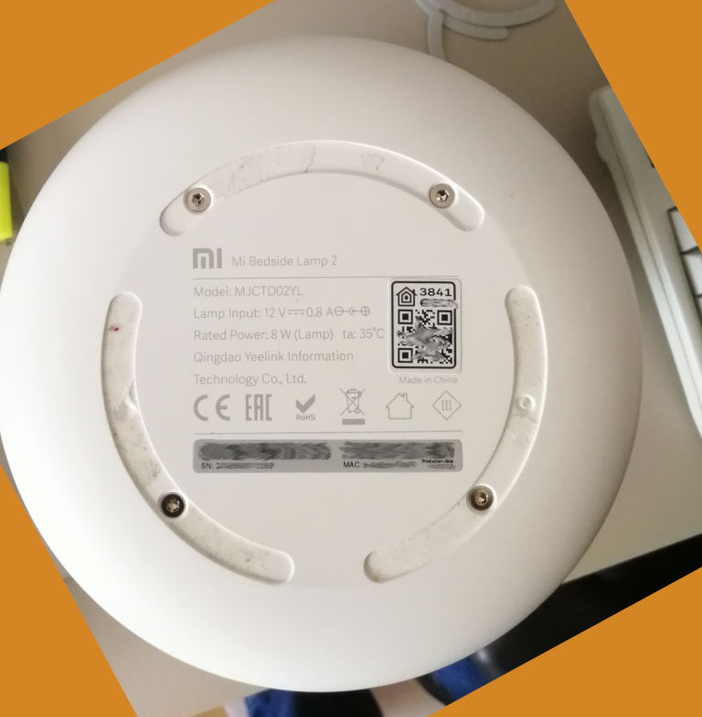

# Flashing the Yeelight Bedside Lamp 2

## Tools needed

* Allen key (2mm, 5/64") or torx (T8) screw driver
* Soldering Iron
* Perhaps some sticky tape
* A serial to USB adapter (FTDI)
* Some wires

## Warning

We have writen these instructions with care, but we will give absolutely no
warranty. Perhaps you will destroy your device and your computer.

## Opening the Yeelight

Remove the rubber pads from the botton of the device.

Unbolt the 4 screws which were hidden by the rubber pads.



Remove the bottom from the device, exposing the PCB.
This might take a bit of force. Just pull it up bit by bit until it pops loose.

For some good picture of disassembling this device, take a look
[at this blog post](https://mysku.ru/blog/china-stores/78455.html)
It is in Russian, but the translation by Google works well and moreover, the
pictures are the most important thing here. If you scroll down, you will
find them easily.

## Solder the wires

Many of the serial to USB adapter have some header pins to which you can
connect the wires of a device. Therefore, I find it most useful to take some
dupont wires with a female end to them, and cut off the other end. Strip the
wire on the other and, and then it can be used to solder it to the board.

Solder the wires to the RX, TX, GND and GPIO0 debug pads that are shown in this
photo. It is not required to solder a wire to the 3.3V debug pad. This pad
is not directly connected to the 3.3V Vin of the ESP32 chip, making it a
less than optimal candidate for powering the board during flashing. Instead,
powering the lamp using its own power supply works best.


You can use some sticky tape to fixate the cables before soldering.

## Connect the wires to your serial to USB device

The wires must be connected as follows:

  | Soldering point| Serial USB Adapter name  |
  | -------------- |:------------------------:|
  | GND            |  GND                     |
  | TX             |  RX                      |
  | RX             |  TX                      |
  | GPIO0          |  GND                     |

To be able to flash the device, GPIO0 must be connected to ground while the
device is booted. Therefore, connect these wires before plugging in the
device's power adapter. Flashing will not work if you connect these wires
when the device has already been powered up.

## When you only have one GND pin on your USB Adapter

If your USB Adapter does not have multiple GND pins, then you'll have
to find another way to attach GPIO0 to ground. Some options:

- Use a breadbord, so you can connect the USB Adapter GND pin to a row on
  the bread bord, and connect the GND and GPIO0 wires of the board to that
  same row. 

- Solder a button on the board that connects GPIO0 to GND when pressed. Then
  you can hold down this button while plugging in the device's power supply.
  After booting up, you can release the button (the serial console will also
  mention that the device is now in flash mode). This is not the most
  practical solution for most people (since only one such flash operation is
  needed, from then on OTA - Over The Air - updates are possible), but it
  was a great help to me during the initial reverse engineering and firmware
  development.

- Manually hold a wire connected to both a GND surface (e.g. the silver pad
  on the left of the board) and the GPIO0 debug pad, while plugging in the
  power supply. After booting, the wire can be removed. This is very fiddly
  way of doing it, but I did it a few times and it can be done.

## Download and install esptool

See: https://github.com/espressif/esptool/blob/master/README.md#installation--dependencies

## Make a backup of the current firmware

```
python esptool.py -p /dev/ttyUSB0 read_flash 0x0 0x400000 original-yeelight-firmware.bin
```

/dev/ttyUSB0 is the port of the usb adaper on Linux. You can find what port
is used by the adapter by running `dmesg` after plugging in the USB device.
On Windows this is often `COM1`, `COM2` or `COM3`.

**Caution**: You will find the WLAN SSID and Password of the latest used WiFi in
this file.

**After each step with esptool, you have to unplug you power line and connect it again.**

## Flash new firmware

Setup an ESPHome Project, see [README.md](../README.md)

You can flash the device using esphome or esptool.
I normally use the [esphome-flasher](https://github.com/esphome/esphome-flasher) 
tool, which is an easy to use utility app for flashing ESPHome devices.  

If you want to flash with esptool, compile with esphome and download the
generated firmware.

```
python.exe .\esptool.py --chip esp32 --port COM3 --baud 115200 write_flash 0x1000 <yourfile.bin>
```

Once your firmware has been flashed, unplug the power and the serial USB Adapter.
Then plug the power back in to boot the device using its new firmware.
From here on, it is possible to flash the device OTA via ESPHOME. Tuck
away those soldered wires in the bottom and add the bottom cover back on.

## Troubleshooting flash

If you have **A fatal error occurred: MD5 of file does not match data in
flash!**, then make sure you are powering the board using the device's own
power adapter. We've seen these errors when trying to power the board using
the 3.3V debug pad.

After seeing this error, user @tabacha was able to successfully flash his
device using the regular power adapter and the tasmota boot loader using
the following command:

```
python esptool.py --chip esp32  -p /dev/ttyUSB0 --baud 115200 --before default_reset --after hard_reset write_flash -z --flash_mode dout --flash_freq 40m --flash_size detect 0x1000 bootloader_dout_40m.bin 0x8000 partitions.bin 0xe000 boot_app0.bin 0x10000 ~/Downloads/schlafzimmerbedlight.bin
```

You will find the missing tasmota boot files here:
https://github.com/arendst/Tasmota/tree/firmware/firmware/tasmota32/ESP32_needed_files

User @tabacha was not able to use tasmota with the bedside lamp 2.

(remember that the [esphome-flasher](https://github.com/esphome/esphome-flasher)
will give you a bit less of a hard-core experience during flashing)


