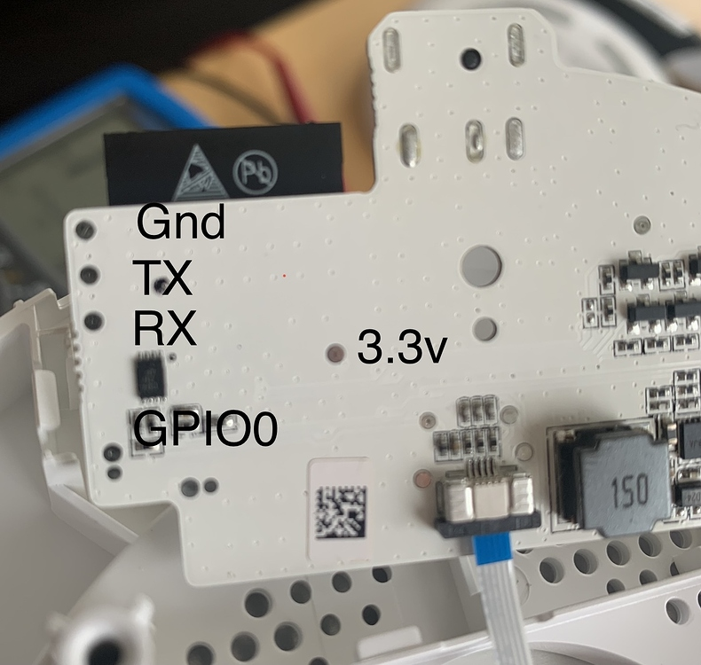

# Flashing guide

## Tools needed

* Allen key (2mm, 5/64") or torx (T8) screw driver
* Soldering Iron
* Perhaps some sticky tape
* A serial to USB adapter (FTDI)
* Some wires

## Warning

We have writen these instructions with care, but we will give absolutely no
warranty. Perhaps you will destroy your lamp and your computer.

## Opening the lamp, to expose the PCB

Remove the rubber pads from the botton of the lamp, to get access to 4
screws that attach the bottom to the rest of the lamp. Note that you don't
have to remove these pads fully. Once you can access the screws, you've
gone far enough.

Unbolt the 4 screws which were hidden under the rubber pads.


Detach the bottom from the rest of the lamp, exposing the PCB. This might
take a bit of force. Just pull it up bit by bit until it pops loose.

For some good pictures of disassembling this lamp, take a look [at this
blog post](https://mysku.ru/blog/china-stores/78455.html) It is in Russian,
but the translation by Google works well and moreover, the pictures are the
most important thing here. If you scroll down, you will find them easily.

## Solder the wires

Many of the serial to USB adapter have some header pins to which you can
connect the wires of a device. Therefore, I find it most useful to take some
dupont wires with a female end to them, and cut off the other end. Strip the
wire on the other and, and solder this end to the board.

Solder the wires to the `RX`, `TX`, `GND` and `GPIO0` debug pads that are
shown in the following photo. It is *not* required to solder a wire to the
`3.3V` debug pad. This pad is not directly connected to the 3.3V Vin of the
ESP32 chip, making it a less than optimal candidate for powering the board
during flashing. Instead, powering the lamp using its own power supply works
best.



You can use some sticky tape to fixate the cables before soldering.

## Connect the wires to your serial to USB adapter

The wires must be connected as follows:

  | Soldering point| Serial USB Adapter name  |
  | -------------- |:------------------------:|
  | GND            |  GND                     |
  | TX             |  RX                      |
  | RX             |  TX                      |
  | GPIO0          |  GND                     |

To be able to flash the lamp, `GPIO0` must be connected to ground while
the lamp boots up. Therefore, connect these wires *before* plugging in
the lamp's power supply. Flashing will not work if you connect these
wires after the lamp has already been booted up.

## When you only have one GND pin on your USB Adapter

If your USB Adapter does not have multiple `GND` pins, then you'll have to
find another way to attach `GPIO0` to ground. Some options:

- Use a breadbord, so you can connect the USB Adapter `GND` pin to a row on
  the bread bord, and connect the `GND` and `GPIO0` wires of the lamp's
  board to that same row.

- Solder a button on the board that connects `GPIO0` to `GND` when pressed.
  Then you can hold down this button while plugging in the lamp's power
  supply. After booting up, you can release the button (the serial console
  will also mention that flash mode is now enabled). This is not the most
  practical solution for most people (since only one such flash operation is
  needed, from then on OTA - Over The Air - updates are possible), but it
  was a great help to me during the initial reverse engineering and firmware
  development.

- Manually hold a wire connected to both a GND surface (e.g. the silver pad
  on the left of the board) and the `GPIO0` debug pad, while plugging in the
  power supply. After booting, the wire can be removed. This is very fiddly
  way of doing it (a third hand would be very welcome with this), but it can
  be done.

- You could opt for temporarily soldering a lead between `GND` and `GPIO0`
  on the board, making `GPIO0` pulled to ground permanently. It is a bit
  less flexible than some other options, but if you only need to do the
  initial backup and firmware flash of the lamp, then this can be all
  that you need. Remove the lead after flashing is done, otherwise the
  lamp won't boot in normal mode.

## Make a backup of the current firmware

Backing up the firmware makes it possible to revert to the original firmware,
in case you have problems with the ESPHome firmware. The backup can be
created using "esptool". Installation instructures can be found here:

  https://github.com/espressif/esptool/blob/master/README.md#installation--dependencies

Here's an example on how to backup the original firmware from Linux. First,
unplug your lamp's power supply, then start the esptool read_flash command:

```
python esptool.py -p /dev/ttyUSB0 read_flash 0x0 0x400000 original-firmware.bin
```

`/dev/ttyUSB0` is the port of the USB adaper on Linux. You can find what
port is used by the adapter by running `dmesg` after plugging in the USB
device. On Windows this is often `COM1`, `COM2` or `COM3`.

Now plug in the power supply. The output of esptool should now show that it
connects to the lamp and downloads the firmware from it.

**Caution**: You will find the WLAN SSID and Password of the last used
WiFi network in this file. Therefore, keep this backup in a safe place.

## Restore the backed up firmware

In case you need to rollback to the lamp's original firmware at some
point, here's an example of how to restore the original firmware from
Windows, by fully flashing it back onto the lamp.

First, unplug your lamp's power supply, then start the esptool write_flash
command:

```
python.exe .\esptool.py --chip esp32 --port COM3 --baud 115200 write_flash 0x00 original-firmware.bin
```

Make sure that `GPIO0` is connected to GND and plug in the power supply.
The output of esptool should now show that it connects to the lamp and
uploads the firmware to it. Be patient after the upload reaches 100%. The
output is silent for a while, but esptool tool is verifying if the firmware
was uploaded correctly.

After the firmware upload completes, unplug the power, disconnect `GPIO0`
from GND and reconnect the power supply to boot into the restored firmware.

## Flash new ESPHome firmware

Setup an ESPHome Project (see [README.md](../README.md)),compile the firmware
for the lamp and download the `firmware.bin` file to the device to which
the serial adapter is connected.

You can flash the lamp using esphome or esptool. I would recommend using
the [esphome-flasher](https://github.com/esphome/esphome-flasher) tool,
which is a very easy to use GUI utility app for flashing ESPHome devices:

- In the app, select the COM port of your serial adapter.
- Also select the firmware.bin file to flash onto the lamp.
- Power up the lamp with `GPIO0` connected to GND.
- Click the "Flash ESP" button to flash the firmware.

If you want to flash with esptool, you can use:

```
python.exe .\esptool.py --chip esp32 --port COM3 --baud 115200 write_flash 0x1000 <path\to\yourfirmware.bin>
```

After flashing, power down the lamp, disconnect `GPIO0` from GND and
reconnect the power to boot into the new ESPHome firmware.

From here on, it is possible to flash the lamp OTA (over the air, which
means that the firmware is uploaded over WiFi) from ESPHome. Therefore, it
is now time to tuck away or remove those soldered wires and add the bottom
cover back on.

## Troubleshooting flash

If you have **A fatal error occurred: MD5 of file does not match data in
flash!**, then make sure you are powering the board using the lamp's own
power adapter. We've seen these errors when trying to power the board using
the 3.3V debug pad.

After seeing this error, user @tabacha was able to successfully flash his
lamp using the regular power adapter and the tasmota boot loader using
the following command:

```
python esptool.py --chip esp32  -p /dev/ttyUSB0 --baud 115200 --before default_reset --after hard_reset write_flash -z --flash_mode dout --flash_freq 40m --flash_size detect 0x1000 bootloader_dout_40m.bin 0x8000 partitions.bin 0xe000 boot_app0.bin 0x10000 ~/Downloads/schlafzimmerbedlight.bin
```

You will find the missing tasmota boot files here:
https://github.com/arendst/Tasmota/tree/firmware/firmware/tasmota32/ESP32_needed_files

*Note: user @tabacha was not able to use tasmota with the Bedside Lamp 2.*

(remember that the [esphome-flasher](https://github.com/esphome/esphome-flasher)
will give you a bit less of a hard-core experience during flashing)
